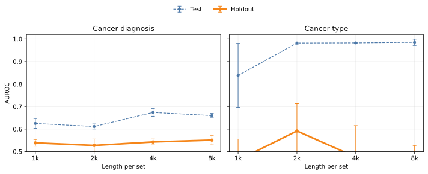
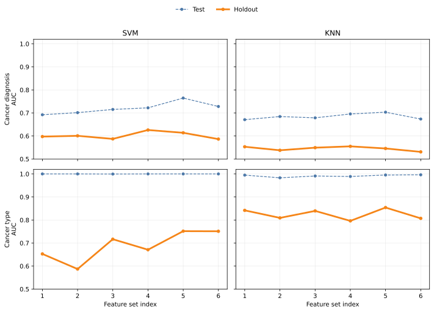

## Abstract

Microbiome-based cancer prediction benchmarks sometimes overestimate real-world performance because test samples are drawn from the same studies used for training,
allowing models to exploit study-specific technical artifacts rather than biological signal.
We present BreCol, a temporally structured multi-study compilation of 2,040 16S rRNA sequencing runs covering
breast cancer, colorectal cancer, and healthy cohorts across 26 studies spanning more than a decade.
By reserving the six most recent studies per cancer type as an external holdout,
we ensure that holdout evaluation reflects deployment on data from new laboratories, clinical protocols, and geographic regions.
We train four classifier pipelines: classical (tetramer counts aggregated to run-level frequencies or
unsupervised clustering with cluster abundance profiles (UC/CAP))
and deep learning (HyenaDNA sequence modeling with mean-pooled token representations of packed contexts).
Among classical methods, UC/CAP achieves the strongest holdout performance (AUC 0.84 for cancer type with KNN, 0.61 for cancer diagnosis with SVM).
The differential between test (in-study) and holdout AUC is 0.15 points for both cancer diagnosis and cancer type prediction
for the best classical classifier, confirming that conventional evaluation inflates apparent model skill.
A pure deep-learning pipeline with HyenaDNA achieves relatively poor results, perhaps because the mean-pooled token representation
before the classification layer discards within-run compositional structure.
Our benchmark and associated code are publicly available to support reproducible, credible evaluation of microbiome-based cancer classifiers.

## Introduction

The community of microorganisms inhabiting the human digestive tract, known as the gut microbiome, is increasingly linked to cancer risk and progression.
Large-scale epidemiological and mechanistic studies have associated compositional shifts in gut bacteria with colorectal cancer (CRC),
and growing evidence implicates gut dysbiosis in breast cancer as well.
Machine learning models trained on microbiome profiles have shown promise for distinguishing cancer patients from healthy controls within individual cohorts,
raising the prospect of non-invasive, microbiome-based cancer screening [@WPK+19; @SHL+25].

The dominant workflow for characterizing the gut microbiome is 16S rRNA amplicon sequencing.
A short, phylogenetically informative region of the bacterial ribosomal gene is amplified and sequenced,
and the resulting reads are matched to known reference taxa to produce species- or genus-level abundance tables.
Most machine learning studies operate on these pre-processed abundance tables, treating the raw sequence data as an intermediate artifact to discard.
This discards potentially informative signal: fine-grained genetic variation within taxa, sequences with no close reference in curated databases,
and compositional structure at the level of individual reads within a sample.
Methods that work directly on raw sequence data or on reference-free sequence features can in principle recover this signal.

A deeper problem, however, arises when test sets are constructed by random sampling from the same studies used for training.
This creates optimistically biased performance estimates that do not reflect real-world deployment.
In microbiome studies the bias is especially severe because technical factors (e.g. primer choice and sequencing platform) and
regional microbiome variation introduce large study-level signals that a model can exploit without learning any biology [@WSNP22].
As a specific example, Sun et al. [@SHL+25] found lower AUC for leave-one-dataset-out (LODO) than for cross-validation (CV)
in CRC prediction from 16S-based taxonomic profiles (average AUC for CV: 0.82, LODO: 0.77).

This problem is exacerbated for cancer type prediction (a different task from cancer vs healthy prediction).
Breast and colorectal cancer samples almost always come from entirely separate studies,
so a classifier can achieve near-perfect in-study accuracy simply by identifying the study of origin rather than the disease.
Evaluating such a model on test samples from the same studies dramatically overestimates generalization.
A reliable benchmark must therefore evaluate models on holdout studies, i.e. studies never encountered during training [@WSNP22].

We address this directly. We curate a compilation of 2,040 16S rRNA sequencing runs spanning 26 studies (13 breast cancer, 13 colorectal cancer),
covering healthy controls and two cancer types across studies from 2013 to 2026.
Studies are partitioned chronologically: the first seven studies per cancer type form the development set (training, validation, and test),
while the more recent six studies per cancer type are reserved as an external holdout.
The temporal and study-level separation in this benchmark provides a demanding but credible measure of real-world generalizability.

Against this benchmark we evaluate a progression of approaches.
For classical machine learning we begin with run-level tetramer frequencies.
First, the 256 possible DNA tetramers are counted in each 16S sequence and aggregated to relative frequencies for each sequencing run.
We then introduce unsupervised clustering with cluster abundance profiles (UC/CAP).
In contrast to run-level aggregation, UC/CAP preserves within-run compositional structure by creating sequence clusters that share similar tetramer counts,
then profiling the cluster affiliation of a large number of sequences from each run.
This method is analogous in purpose to operational taxonomic unit (OTU)-based approaches but is reference-free;
that is, it operates entirely on sequence composition without taxonomic assignment.

For deep learning we use HyenaDNA [@NPF+23], a long-range genomic sequence model pretrained on the human reference genome.
We first train a multilayer perceptron (MLP) classification head on top of a mean-pooled token representation.
Because this pooled representation collapses all sequences in a packed context into a single vector,
it cannot capture within-run compositional structure (a similar limitation to run-level aggregation of tetramer frequencies).

Our main contributions are (1) a rigorously curated, temporally structured multi-study benchmark for microbiome-based cancer classification
that provides more reliable estimates of real-world performance than within-study splits,
and (2) a reference-free cluster abundance profile method that shows consistent gains on cancer diagnosis and type classification,
achieving performance comparable to conventional analysis of microbial abundance features.

## Methods

### Data curation

Each sample corresponds to a sequencing run containing multiple 16S rRNA gene sequences.
We collected sequencing runs from studies covering breast cancer and colorectal cancer;
studies were only included if both cancer-positive and healthy control labels were available.
We stored SRA Run accessions (beginning with SRR, ERR, or DRR) and study metadata in the repository and downloaded each run's read archive from NCBI.

Our compilation spans 26 studies in total—13 for breast cancer and 13 for colorectal cancer (Table 1).
Arranged chronologically by publication year, the first seven studies per cancer type form the development partition
(train, validation, and test splits), and the more recent six studies per cancer type are reserved as the holdout partition.
Development and holdout sets are separated not only by study boundaries but also by time: all holdout studies are from 2023 onward.
This design makes the benchmark a realistic challenge: predictions must transfer to future datasets available only after the model was trained.

: Breast and colorectal cancer studies included in the BreCol compilation, arranged chronologically by publication year and partitioned into development
(first seven studies per cancer type) and holdout (remaining six per cancer type) sets.
Sample counts reflect counts after stratified subsampling at the indicated rate.

|Ref|Year|Type|Cancer|Healthy|Rate|BioProject|Partition|
|---|---|---|---|---|---|---|---|
|[@AAM+13]|2013|breast|29|32|1|PRJNA396901|development|
|[@GJH+15]|2015|breast|47|47|1|PRJNA345373|development|
|[@GHB+18]|2018|breast|48|48|1|PRJNA383849|development|
|[@BVW+21]|2021|breast|57|63|0.15|PRJNA658160|development|
|[@BSR+22]|2022|breast|19|14|1|PRJEB54599|development|
|[@WZK+22]|2022|breast|54|25|1|PRJNA804967|development|
|[@ZZZ+22]|2022|breast|14|14|1|PRJNA726050|development|
|[@SKC+23]|2023|breast|22|21|1|PRJNA872152|holdout|
|[@LBA+25]|2025|breast|76|16|1|PRJNA1127492|holdout|
|[@SYL+25]|2025|breast|10|10|1|PRJNA1243283|holdout|
|[@MTK+26]|2026|breast|32|32|1|PRJNA914483|holdout|
|[@SVK+26]|2026|breast|22|30|1|PRJNA1356467|holdout|
|[@YTK+26]|2026|breast|15|15|1|PRJNA1190698|holdout|
|[@ZTV+14]|2014|colorectal|41|75|1|PRJEB6070|development|
|[@BRRS16]|2016|colorectal|64|94|0.5|PRJNA290926|development|
|[@OKN+21]|2021|colorectal|67|51|0.1|PRJDB11246|development|
|[@YDS+21]|2021|colorectal|65|43|0.35|PRJNA763023|development|
|[@YWS+21]|2021|colorectal|53|52|1|PRJEB36789|development|
|[@DLT+22]|2022|colorectal|27|33|1|PRJNA824020|development|
|[@PCL+22]|2022|colorectal|36|25|1|PRJNA662014|development|
|[@BWY+23]|2023|colorectal|46|43|1|PRJEB53415|holdout|
|[@BRR+24]|2024|colorectal|51|51|1|PRJEB71787|holdout|
|[@CAB+24]|2024|colorectal|90|30|1|PRJNA911189|holdout|
|[@SGH+24]|2024|colorectal|10|10|1|PRJNA1059759|holdout|
|[@ARF+25]|2025|colorectal|25|15|1|PRJEB76625|holdout|
|[@GYX+25]|2025|colorectal|67|64|0.6|PRJNA1092526|holdout|
|||||||PRJNA1092376||

Some studies have substantially larger sample counts than others.
To improve study balance, we applied random sampling within several studies (stratified by cancer-versus-healthy label).
The sample sizes in Table 1 reflect counts after sampling at the indicated rate; these samples are flagged as `sample_used=TRUE` in the data CSV files.
Additionally, for two studies ([@BVW+21] and [@CAB+24]) we excluded runs with <2000 spots.

### Preprocessing, splits, and sampling

We normalized sample labels to a restricted vocabulary: healthy, breast cancer, and colorectal cancer.
Breast cancer samples include invasive tumors; colorectal cancer samples include carcinoma.
Any benign samples (e.g. adenomas, benign colon polyps, and breast ductal carcinoma in situ (DCIS))
and non-fecal samples in the studies were excluded from our analysis.

Among development studies, we assigned each sequencing run to stratified training, validation, or test sets in a 70:15:15 ratio.
Runs from holdout studies were excluded from this assignment.
Split assignments were defined in advance from study lists and per-study sample tables, independent of any downstream feature computation.

We held the validation set fixed (no cross-validation).
This allows the same development splits to be used consistently across both the classical and HyenaDNA pipelines,
since GPU-intensive language model training makes repeated cross-validation expensive.
The same run-level split underlies both classification tasks: cancer versus healthy (cancer diagnosis) on all samples,
and breast versus colorectal (cancer type) restricted to cancer-positive samples.

For all classification pipelines we dropped the first 1000 sequences in each run as a QC measure.
We then randomly sampled 5000 sequences from the remaining sequences in each run (or used sequence sets packed to a maximum length for HyenaDNA training).
These sequences were used to create caches of sequence-level tetramer counts and HyenaDNA run tensors
that were sliced into for rapid experimentation with different sample sizes used for training.

### Run-level tetramer frequencies and classification pipeline

We calculated tetramer frequencies for each run by counting all 4-mers within each sequence,
summing counts over all sequences in the run, then converting to relative frequencies, yielding a 256-dimensional feature vector per run.

For the majority-class baseline, we predict the most frequent class in the training set for all samples.

#### Hyperparameter grid search

Table 2 lists the hyperparameter values used for grid search.

: Classifier models and hyperparameter grids used in run-level tetramer frequency classification
and in UC/CAP classification for tetramer counts.

| Model | Hyperparameters |
|-|-|
| KNN | PCA n_components (none, 0.95), n_neighbors (5, 15) |
| SVM | PCA n_components (none, 0.95), C (1.0, 10.0) |
| Random Forest | n_estimators (200, 500), max_depth (none, 10), min_samples_leaf (1, 2) |

For both KNN and SVM we applied a centered log-ratio transform (CLR), standardized the CLR coordinates, then applied PCA.
For KNN we used inverse distance weighting and tuned the PCA components and number of neighbors.
For SVM, we used an RBF kernel and tuned the PCA components and penalty parameter *C*.
The kernel width parameter *gamma* was left at scikit-learn's default ('scale').

For random forest, we used the same CLR and standardization but omitted PCA.
We tuned the number of trees, maximum tree depth, and minimum samples per leaf.

After selecting hyperparameters using area under the receiver operating characteristic (ROC) curve (AUC) by grid search on the validation split,
we fit each final pipeline on the training split.

### HyenaDNA sequence modeling and classification

We trained HyenaDNA on 16S RNA sequence data to test an end-to-end sequence model.
For each run, we read the FASTA file and split its sequences into a fixed number of non-overlapping sets.
Each set was packed to the model length limit and tokenized at the DNA character level.

We initialized HyenaDNA from pretrained weights, using a multitask configuration (two MLP classification heads attached to the same backbone).
In each forward pass, the cross-entropy loss for each task was computed separately and combined with equal weight.
Because each run can produce multiple sequence sets, training loss was computed across all valid sets for each run.
At evaluation, we averaged set-level logits to obtain one prediction per run,
then computed AUC on the same test and holdout splits used for the tetramer and UC/CAP analyses.

Head pooling mode was set to mean pooling, the model was trained for 10 epochs, and batch size was adjusted to maximize GPU memory utilization.
Other hyperparameters (maximum length of sequence sets, learning rate, MLP size and dropout, and backbone unfreezing) were used for ablations.

### Cluster abundance profiles for tetramer counts

Run-level tetramer features summarize each sample with a single aggregate profile and do not capture how different sequence types are distributed within a run.
To preserve this within-run compositional structure, we use unsupervised clustering followed by cluster abundance profiles (UC/CAP),
a reference-free and alignment-free approach.

Because the sequence-level table is large, we first fit the unsupervised clustering model using only sequences from training-split runs,
drawing at most a fixed number of sequences per run.
For each selected sequence we computed a 256-dimensional tetramer composition vector,
then fit *k*-means to all selected sequences to obtain *K* centroids defining a sequence codebook.
Dimensionality reduction with PCA before *k*-means was trialed and found to degrade downstream classification results, so it was not used here.

To construct run-level features, we applied the same centroid assignments (without refitting)
to a larger per-run sequence budget for every run in the sequence-level table, including validation, test, and holdout runs.
We counted cluster memberships within each run and normalized by the number of assigned sequences to produce a *K*-dimensional cluster abundance profile (CAP).
These CAP vectors serve as the feature matrix for supervised classification on both binary tasks, with downstream classifiers selected separately per task.

### Fine-tuning the SetBERT model

SetBERT is a transformer architecture for high-throughput sequencing data that contextualizes individual reads within their parent sample [@LGA+25].
Unlike HyenaDNA, SetBERT has been pretrained on microbial 16S rRNA sequences [@LGA+25].
In the released qiita-16s checkpoint, a 12-layer DNABERT encoder first embeds each amplicon read independently into a 768-dimensional vector;
a 6-layer transformer of Set Attention Blocks (SABs) with 12 heads then operates on the set of read embeddings for one run,
producing contextualized read vectors plus a learned class-token summary.
The checkpoint was pretrained on roughly 280,000 Qiita 16S amplicon samples with a relative-abundance prediction objective over a fixed taxonomic vocabulary [@LGA+25].

For our two binary classification tasks we attached a single linear classification head to the transformed class token and trained with binary cross-entropy.
Following the SetBERT paper we used 1,000 reads per run as the set size, trimmed each selected read to 150 base pairs,
and tokenized into overlapping 3-mers using the DNABERT tokenizer bundled with the checkpoint.

During development we discovered that the SetBERT model code wraps the per-read DNABERT forward pass in PyTorch's activation-checkpointing utility with use_reentrant=True.
Because the wrapped call only receives integer token IDs (which cannot carry gradients),
the reentrant checkpoint silently drops the backward path through the encoder, so DNABERT parameters never receive gradients even when they are nominally trainable.
We patched the upstream model to use use_reentrant=False, which uses saved-tensor rematerialization to propagate gradients to the encoder parameters correctly,
and confirmed the fix by verifying that all encoder parameters have nonzero gradients after one backward step.

Because both DNABERT and the SAB stack are pretrained while the linear classifier is randomly initialized,
we trained in three phases to limit catastrophic forgetting of the pretrained representations.
In Phase 1, both the encoder and the SAB were frozen and only the classification head was updated,
allowing the head to fit to the frozen class-token output before any pretrained weights received gradients.
In Phase 2, we unfroze the SAB so the set-level aggregation could adapt to the task while the larger DNABERT encoder remained frozen.
In Phase 3, we unfroze the encoder as well and continued fine-tuning all pretrained weights,
scaling the backbone learning rate to one tenth of the head learning rate to limit destabilization.
Final settings (per-phase epoch budget and seed grid) are reported with the SetBERT results.

### Implementation

The benchmark dataset is composed of CSV files with instructions and scripts for downloading data from NCBI and preprocessing.
The project code is written in Python with YAML configuration and a Makefile-driven analysis pipeline.
The official HyenaDNA implementation was modified for this project and structured as a pip-installable package for import by analysis scripts.
After downloading, the entire pipeline runs in ca. 22 hours on a machine with 8 CPU cores, 40 GB of RAM, and a 16 GB NVIDIA GPU.

## Results

We define two binary classification tasks: **cancer diagnosis** (cancer vs. healthy, all samples)
and **cancer type** (breast vs. colorectal, cancer-positive samples only).
Performance is reported as AUC on the test split (unseen samples from the development studies used to train the model)
and the holdout split (entirely unseen studies).

For cancer type, all development studies for breast cancer are separate from all development studies for colorectal cancer.
A model can therefore exploit study-level signals, e.g. different sequencing protocols, primer sets, or regional microbiome composition,
as a near-perfect shortcut for in-study test performance.
Holdout performance, where the model encounters new studies it has not seen during training, removes this shortcut.
We accordingly expect cancer type to be the *easier* task for in-study test data but the *harder* task for holdout data.

For cancer diagnosis, each included study contains both cancer-positive and healthy samples,
so study identity alone does not predict the label. Models must learn biological differences between cancer and healthy microbiomes within studies,
and those differences are expected to transfer, at least partially, to new studies.

### Classification with run-level tetramer frequencies

All models exceed the majority-class baseline on the test split, with particularly large margins for cancer type prediction (Table 3).
The holdout picture is sharply different.
For cancer diagnosis, SVM achieves a modest AUC of 0.6 while random forest and KNN fall closer to baseline.
For cancer type, SVM reaches an AUC of 0.67 while KNN collapses to baseline on holdout.
The stark contrast with test performance (AUC >0.9) confirms that tetramer classifiers overfit to study-level signals when trained on single-study cancer-type data.

[Table 3 data](table3_tetramer.html "Test and holdout AUC for run-level tetramer frequency classification
with the majority-class baseline, KNN, SVM, and random forest. Bold marks the best value per column.").

### Classification with HyenaDNA sequence modeling

We report a fine-tuning grid for the pretrained 32k HyenaDNA model.
Given available hardware (16 GB GPU memory), we are limited to smaller model sizes and sequence budgets than the full model supports.

#### Hyperparameter ablations

We trained HyenaDNA with the ablations listed below; results are summarized in Table 4.

1. Best recipe (baseline)
2. High learning rate (5e-4 instead of 2e-4)
3. Add dropout to MLP classification head (0.2)
4. MLP hidden layer width 256 (instead of 512)
5. Unfrozen backbone (learning rate: 2e-4)
6. Unfrozen backbone (low learning rate: 1e-5)

[Table 4 data](table4_hyenadna.html "HyenaDNA fine-tuning results on the multitask 32k model for the best recipe and targeted ablations,
reported as mean ± standard deviation across five random seeds. Epoch is the mean epoch number with the best mean validation AUC across both tasks.").

Several trends are apparent in these ablations.
Increasing learning rate, adding dropout, or decreasing the MLP hidden layer width have no discernible effect on test or baseline performance within error.
The improvements on holdout associated with unfrozen backbone (most notably for cancer type) are tempered by higher variability.
Lowering the learning rate in our experiments did not stabilize the predictions with full model fine-tuning.

We also verified that using float16 AMP, gradient clipping (norm 1.0), or tuning by validation F1 instead of AUC did not move holdout AUC beyond error.

#### Effects of modeled sequence length

For each task (cancer diagnosis and cancer type) we trained separate classification heads on the same backbone (multitask model).
We varied the length per set (up to 1k, 2k, 4k, 8k, 16k, and 32k positions) to study how much sequence context per run matters.
A single large cache (32k length for each sequence set) was built from randomly sampled FASTA sequences after skipping the first 1000 in each run.
Shorter training configurations were obtained from that cache by truncating to the target length.

Figure 2 shows AUC on the test and holdout splits as a function of length per set, within each task (columns).
Holdout performance is generally weaker than test performance.
The cancer diagnosis task shows mildly increasing performance with context length, but the cancer type curve is not monotone in context length.
Increasing the number of bases modeled per set does not reliably improve generalization for cancer type prediction.

### Classification with cluster abundance profiles for tetramer counts

We explored six combinations of the three UC/CAP hyperparameters defined by *n*UC (sequences per run used for unsupervised clustering),
*K* (number of clusters), and *n*CAP (sequences per run assigned to centroids and used to build cluster abundance profiles) (Table 5).

: UC/CAP feature sets.

| Feature set | *n*UC | *K* | *n*CAP | Feature set | *n*UC | *K* | *n*CAP |
|-|-|-|-|-|-|-|-|
| 1 |  500 | 1000 |   500 | 4 | 1000 | 1000 |  5000 |
| 2 | 1000 | 1000 |  1000 | 5 | 1000 | 2000 |  5000 |
| 3 | 1000 | 2000 |  1000 | 6 | 1000 | 3000 |  5000 |

These UC/CAP parameters produced six different cluster abundance profiles (or feature sets) used for standard supervised classification
with the models and hyperparameter grids described above (Table 2). 
SVM achieves higher holdout AUC than KNN across feature sets for cancer diagnosis, but the pattern is reversed for cancer type, where KNN leads (Figure 3).
For cancer type, both models show near-perfect in-study test performance across feature sets, but holdout values drop sharply.

Table 6 shows the results for the best UC/CAP feature set as judged by *test* AUC in each task,
so we can legitimately assess holdout performance on unseen studies.
For cancer diagnosis, SVM achieves the best holdout performance, followed by random forest and KNN.
For cancer type, KNN leads on holdout, followed by random forest and SVM.

The gap between in-study test and holdout is again large for cancer type, but UC/CAP with KNN achieves substantially higher cancer type holdout AUC
than any tetramer-based classifier, demonstrating that richer within-run compositional features partially attenuate the study-level shortcut problem.

[Table 6 data](table6_tetramer_uc_cap.html "Test and holdout AUC for UC/CAP cluster abundance profiles built from tetramer counts,
with the best feature set selected per task by test AUC.").

## Discussion

We list our per-study AUC for cancer diagnosis and comparisons with colorectal cancer where available (Table 8).
On two of the three development studies with a published comparison ([@ZTV+14] and [@YDS+21]), our per-study test AUC is very high (0.97--0.98),
but it drops to 0.67 on a third dataset where the literature value is 0.85 [@BRRS16].
For holdout studies with published AUC values ([@BWY+23], [@CAB+24], [@GYX+25]), our AUC (0.66--0.74) is consistently lower than the literature (0.86--0.88).
The literature numbers come from within-study cross-validation or test splits rather than independent cohorts
and are therefore not directly comparable to true holdout performance.

[Table 8 data](table8_auc_comparison.html "Per-study cancer diagnosis AUC from the best tetramer UC/CAP classifier selected in Table 6 (SVM, feature set 5).
AUC is computed over each study's test-split runs (development) or all runs (holdout); the *n* column reports the total number of samples (cancer + healthy) contributing to each per-study AUC. Literature AUC values for colorectal cancer are shown where reported.")

We did not find direct AUC comparisons in the literature for the breast cancer datasets we used.
Here we compare with some different studies for breast cancer:

- Wang et al. [@WYH+22] trained random forest classifiers on fecal microbiome data from breast cancer patients and healthy controls,
  achieving an AUC of around 0.68 for stool samples; cross-cohort validation yielded average AUCs of 0.65--0.66.
  These cross-cohort values are in the range of our per-study holdout AUC for breast cancer (Table 8),
  though the studies and cohorts differ.

- Daga and Oudah [@DO24] reported a peak AUC of 0.83 for breast cancer classification
  using a feature-selected subset with a Bernoulli Naïve Bayes classifier.
  This figure reflects within-cohort performance and is not directly comparable to our holdout results,
  but it illustrates the gap that typically exists between in-study and cross-study evaluation.

Results are consistently lower on the holdout splits than on the in-study test splits,
confirming that test performance computed within the same studies used for training gives overoptimistic estimates of real-world model skill.
This pattern holds across run-level tetramer frequencies and the UC/CAP pipeline.

Comparing holdout performance across Tables 3 and 6, UC/CAP offers a consistent advantage over run-level tetramer features for cancer type classification.
However, it barely improves holdout AUC for cancer diagnosis, despite a large increase on in-study test splits.
Our finding suggests that the compositional diversity captured by cluster abundance profiles
partially breaks the study-level shortcuts that hinder tetramer-based cancer type classifiers.
At the same time, transferable information to discriminate cancer vs healthy may not reside in fine-scale compositional structure.

At 16k tokens per set and 5 sets per run, HyenaDNA sees only around 400 sequences from each sample (assuming 200 nt 16S fragments),
a small fraction of what the tetramer and UC/CAP methods use.
The low number of sequences and their aggregated representation before the classification layer may explain the low accuracy of our current pure deep-learning setup.

Several directions may improve performance beyond current baselines.
On the feature side, UC/CAP parameters (*K*, *n*CAP) could be tuned jointly with the classifier rather than independently,
and soft cluster assignments (Gaussian mixture or fuzzy *k*-means) might better represent the continuous composition of microbial communities.
For HyenaDNA, additional pretraining on 16S rRNA sequences specifically (rather than the human genome)
would better align the model's learned representations with the target domain.

More broadly, our results underscore a general lesson for machine learning applied to genomic and microbiome data:
metrics computed on within-study test splits can be misleading by a wide margin.
Robust evaluation against temporally and geographically diverse holdout cohorts should be a standard requirement in this field [@WSNP22].

## Acknowledgments

This study uses data made available by many previous studies.
All contributors to those studies are acknowledged for making this study possible.

## Declaration of generative AI use

Cursor was used for code generation.
Cursor and Claude Sonnet 4.6 were used for writing sections of the manuscript.
Claude Sonnet 4.6 was used for polishing the text.

AI-generated text was incorporated into the manuscript after human review and cleanup by the author.
For example, Claude Sonnet wrote "Microbiome-based cancer prediction benchmarks routinely overestimate real-world performance" for the Abstract.
The author decided that this was an exaggeration and changed "routinely" to "sometimes".
The author remains accountable for this work but cannot guarantee that it is completely free of AI biases or mistakes.

## Code and data availability

Code and data are available at <https://github.com/jedick/BreCol>.
The repository also holds the manuscript files and polishing prompts.

## References

::: {#refs}
:::
