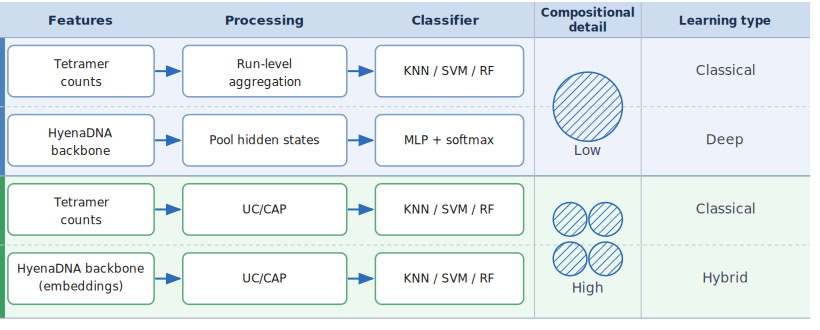
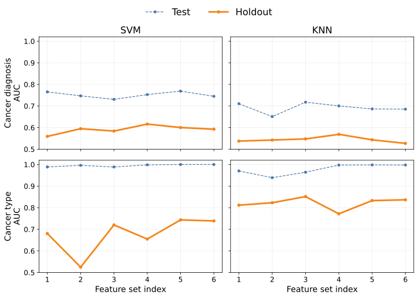

## Abstract

Processing gut microbiomes for cancer diagnosis and cancer type prediction needs robust evaluations across multiple datasets.
We introduce **BreCol**, a multi-study 16S rRNA benchmark of 2,040 sequencing runs across 26 studies
spanning **bre**ast cancer, **col**orectal cancer, and healthy cohorts.
Holdout evaluation uses the six most recent studies per cancer type, reflecting temporal separation from training data.
Features are derived from tetramer frequencies using unsupervised clustering, preserving within-run compositional signal.
Classical models reach holdout AUCs of 0.60 for cancer diagnosis and 0.83 for cancer type prediction.
Colorectal cancer is consistently easier to detect than breast cancer when models are trained on both cancer types simultaneously.
We also evaluate two deep learning pipelines: HyenaDNA, a long-range sequence model that pools backbone hidden states across token positions for classification,
and SetBERT, a transformer that produces contextualized embeddings over sets of reads.
Both deep learning models underperform the best classical methods on holdout data, though tuning training set size and the classification head yields modest gains.
Our classical pipeline achieves near state-of-the-art performance without using taxonomic assignments.
BreCol data and associated code are publicly available.

## Introduction

The community of microorganisms inhabiting the human digestive tract, known as the gut microbiome, is increasingly linked to cancer risk and progression.
Clinical studies have associated compositional shifts in gut bacteria with colorectal cancer (CRC) [@ZFL18],
and growing evidence implicates gut dysbiosis in breast cancer as well [@YTF+17; @ZXS21].
Machine learning models trained on microbiome profiles have shown promise for distinguishing cancer patients from healthy controls within individual cohorts,
raising the prospect of non-invasive, microbiome-based cancer screening [@WPK+19; @SHL+25].

The dominant workflow for characterizing the gut microbiome is 16S rRNA amplicon sequencing.
A short, phylogenetically informative region of the bacterial ribosomal gene is amplified and sequenced,
and the resulting reads are matched to known reference taxa to produce species- or genus-level abundance tables.
Most machine learning studies operate on these pre-processed abundance tables, treating the raw sequence data as an intermediate artifact to discard.
This discards potentially informative signal: fine-grained genetic variation within taxa, sequences with no close reference in curated databases,
and compositional structure at the level of individual reads within a sample.
Methods that work directly on raw sequence data or on reference-free sequence features can in principle recover this signal.

A deeper problem, however, arises when test sets are constructed by random sampling from the same studies used for training.
This creates optimistically biased performance estimates that do not reflect real-world deployment.
In microbiome studies the bias is especially severe because technical factors (e.g. primer choice and sequencing platform) and
regional microbiome variation introduce large study-level signals that a model can exploit without learning any biology [@WSNP22; @SHL+25].

This problem is exacerbated for cancer type prediction (a different task from cancer vs healthy prediction).
Breast and colorectal cancer samples almost always come from entirely separate studies,
so a classifier can achieve near-perfect in-study accuracy simply by identifying the study of origin rather than the disease.
We are not aware of existing benchmarks that measure the performance of cancer-type classifiers on holdout studies.

Reliable benchmarks for both cancer diagnosis and type prediction must evaluate models on one or more "prediction sets" [@WSNP22],
i.e. studies never encountered during training, which we refer to as holdout studies.
To do this, we curated a new compilation of 2,040 16S rRNA sequencing runs spanning 26 studies (13 breast cancer, 13 colorectal cancer),
covering healthy controls and two cancer types across studies from 2013 to 2026.
Studies are partitioned chronologically: the first seven studies per cancer type form the development set (training, validation, and test),
while the more recent six studies per cancer type are reserved as an external holdout.
The temporal and study-level separation in this benchmark provides a demanding but credible measure of real-world generalizability.

Against this benchmark we evaluate a progression of feature representations and learning approaches (Figure 1).
For classical machine learning we use either run-level aggregated tetramer frequencies or cluster abundance profiles.
For deep learning we fine-tune two pre-trained sequence models:
HyenaDNA, which encodes packed sets of sequences with a mean-pooled token representation,
and SetBERT, which contextualizes individual reads within their parent sample.
Both models are described in the **Models** section below.

Our main contributions are (1) a custom curated, temporally structured multi-study benchmark for microbiome-based cancer classification
that provides more reliable estimates of real-world performance than within-study splits,
(2) a reference-free cluster abundance profile method that achieves the best overall holdout performance among our tested models,
and (3) a comparison of two deep-learning sequence models (HyenaDNA and SetBERT) showing that both trail the best classical methods on holdout data,
with HyenaDNA generalizing somewhat better than SetBERT.

## Models

### Classical machine learning

Rather than performing taxonomic classification, we count tetramer occurrences in each raw 16S sequence
to generate a 256-dimensional feature space from sequence composition alone.
Tetramer frequencies, also known as tetranucleotide frequencies, have proven useful for taxonomic binning of metagenomic sequences [@DAB+09].
Tetramer counting is a specific instance of *k*-mer counting, which has recently gained interest
as an efficient, reference-free method for feature engineering in microbiome machine learning [@Bok25].

For run-level features, tetramer counts are summed across all sequences in a run and converted to relative frequencies.
Because these run-level features are averages, they lose within-run compositional structure, i.e.
information about which sequence types tend to co-occur in the same sample.
Taxonomic profiling preserves this structure through genus- or species-level groupings,
but taxonomic assignment is not the only route to sequence similarity clusters.

Here we use unsupervised clustering with cluster abundance profiles (UC/CAP).
Rather than averaging across all sequences, UC/CAP build sequence clusters with similar tetramer composition
and then profiles the cluster membership of a large number of sequences from each run.
This approach is analogous in purpose to operational taxonomic unit (OTU)-based methods, but entirely reference-free.

### Deep learning

**HyenaDNA** [@NPF+23] is a long-range genomic sequence model pre-trained on the human reference genome.
It uses single-nucleotide tokens and a Hyena operator to process sequences of up to 1 million bases.
For each sequencing run we pack sequences into sets (up to 16k nucleotides per set, 5 sets per run)
and mean-pool the per-position hidden states of the backbone to produce a single vector for classification.
Because this pooled representation collapses all sequences in a set into one vector,
it cannot capture within-run compositional structure, a limitation shared with run-level tetramer aggregation.

**SetBERT** [@LGA+25] is a transformer architecture designed specifically for high-throughput sequencing data.
It represents each read with a DNABERT sequence encoder (3-mer tokens, 768-dimensional embeddings in the released *qiita-16s* checkpoint)
and then contextualizes the full set of reads from one run with a stack of Set Attention Blocks (SABs).
SABs are standard transformer blocks without positional encoding, making the model permutation-equivariant.
A learned class token ([CLS]) prepended to the set is conditioned on all reads by the SABs;
its output embedding summarizes the entire run and serves as input to the classification head.
Unlike HyenaDNA, SetBERT was pre-trained on approximately 280,000 microbial 16S amplicon samples
with a relative-abundance prediction objective [@LGA+25],
making its learned representations relevant to the domain.

Although HyenaDNA offers larger context lengths (up to 1 million bases) and SetBERT was pre-trained with 1000 sequences per run
and tested with up to 10,000 sequences per run [@LGA+25], we use a smaller number of sequences due to lower GPU resources (16 GB GPU RAM) available in our study.

### Classification heads

For both models we tried three classification head architectures applied to the run-level summary vector.
A **linear** head is a single fully connected layer mapping the embedding to a scalar logit;
this is the simplest option and the one used in the original HyenaDNA paper, where it is referred to as the decoder head.
An **MLP** (multi-layer perceptron) head adds a hidden layer (256 units, GELU activation, 0.1 dropout)
before the output layer, giving the classifier more capacity to learn non-linear decision boundaries.
A **cosine similarity** head projects the embedding onto a single learned direction, scoring it by cosine similarity scaled by a learnable temperature.
Because cosine similarity is direction-only, it is sensitive to the orientation of the embedding vector rather than its magnitude.
The SetBERT pre-training objective uses a linear head with softmax for relative abundance prediction, so the linear head is the closest to the pre-trained regime.

For both models we used a learning rate of 1×10^-4^ for the classification head
and 1×10^-5^ for the backbone (a 10× reduction to preserve pre-trained representations).
Models were trained for 5 epochs and the epoch with the highest validation AUC was selected.

## Methods

### Data curation

Each sample corresponds to a sequencing run containing multiple 16S rRNA gene sequences.
We collected sequencing runs from studies covering breast cancer and colorectal cancer;
studies were only included if both cancer-positive and healthy control labels were available.
We stored SRA Run accessions (beginning with SRR, ERR, or DRR) and study metadata in the repository and downloaded each run's read archive from NCBI.

Our compilation spans 26 studies in total: 13 for breast cancer and 13 for colorectal cancer (Table 1).
Arranged chronologically by publication year, the first seven studies per cancer type form the development partition
(train, validation, and test splits), and the more recent six studies per cancer type are reserved as the holdout partition.
Development and holdout sets are separated not only by study boundaries but also by time: all holdout studies are from 2023 onward.
This design makes the benchmark a realistic challenge: predictions must transfer to future datasets available only after the model was trained.

: Breast and colorectal cancer studies included in the BreCol compilation, arranged chronologically by publication year and partitioned into development
(first seven studies per cancer type) and holdout (remaining six per cancer type) sets.
Cancer and healthy numbers reflect counts after stratified subsampling at the indicated rate.

|Ref|Year|Type|Cancer|Healthy|Rate|BioProject|Partition|
|---|---|---|---|---|---|---|---|
|[@AAM+13]|2013|breast|29|32|1|PRJNA396901|development|
|[@GJH+15]|2015|breast|47|47|1|PRJNA345373|development|
|[@GHB+18]|2018|breast|48|48|1|PRJNA383849|development|
|[@BVW+21]|2021|breast|57|63|0.15|PRJNA658160|development|
|[@BSR+22]|2022|breast|19|14|1|PRJEB54599|development|
|[@WZK+22]|2022|breast|54|25|1|PRJNA804967|development|
|[@ZZZ+22]|2022|breast|14|14|1|PRJNA726050|development|
|[@SKC+23]|2023|breast|22|21|1|PRJNA872152|holdout|
|[@LBA+25]|2025|breast|76|16|1|PRJNA1127492|holdout|
|[@SYL+25]|2025|breast|10|10|1|PRJNA1243283|holdout|
|[@MTK+26]|2026|breast|32|32|1|PRJNA914483|holdout|
|[@SVK+26]|2026|breast|22|30|1|PRJNA1356467|holdout|
|[@YTK+26]|2026|breast|15|15|1|PRJNA1190698|holdout|
|[@ZTV+14]|2014|colorectal|41|75|1|PRJEB6070|development|
|[@BRRS16]|2016|colorectal|64|94|0.5|PRJNA290926|development|
|[@OKN+21]|2021|colorectal|67|51|0.1|PRJDB11246|development|
|[@YDS+21]|2021|colorectal|65|43|0.35|PRJNA763023|development|
|[@YWS+21]|2021|colorectal|53|52|1|PRJEB36789|development|
|[@DLT+22]|2022|colorectal|27|33|1|PRJNA824020|development|
|[@PCL+22]|2022|colorectal|36|25|1|PRJNA662014|development|
|[@BWY+23]|2023|colorectal|46|43|1|PRJEB53415|holdout|
|[@BRR+24]|2024|colorectal|51|51|1|PRJEB71787|holdout|
|[@CAB+24]|2024|colorectal|90|30|1|PRJNA911189|holdout|
|[@SGH+24]|2024|colorectal|10|10|1|PRJNA1059759|holdout|
|[@ARF+25]|2025|colorectal|25|15|1|PRJEB76625|holdout|
|[@GYX+25]|2025|colorectal|67|64|0.6|PRJNA1092526|holdout|
|||||||PRJNA1092376||

Some studies have substantially larger sample counts than others.
To improve study balance, we applied random sampling within several studies (stratified by cancer vs healthy label).
The sample sizes in Table 1 reflect counts after sampling at the indicated rate.
Additionally, for two studies (refs [@BVW+21] and [@CAB+24]) we excluded runs with <2000 spots.

### Preprocessing, splits, and sampling

We normalized sample labels to a restricted vocabulary: healthy, breast cancer, and colorectal cancer.
Breast cancer samples include invasive tumors; colorectal cancer samples include carcinoma.
Any benign samples (e.g. adenomas, benign colon polyps, and breast ductal carcinoma in situ (DCIS))
and non-fecal samples in the studies were excluded from our analysis.

Among development studies, we assigned each sequencing run to stratified training, validation, or test sets in a 70:10:20 ratio.
Runs from holdout studies were excluded from this assignment.
Split assignments were defined in advance from study lists and per-study sample tables, independent of any downstream feature computation.

We held the validation set fixed (no cross-validation).
This allows the same development splits to be used consistently across both the classical and HyenaDNA pipelines,
since GPU-intensive language model training makes repeated cross-validation expensive.
The same run-level split underlies both classification tasks: cancer versus healthy (cancer diagnosis) on all samples,
and breast versus colorectal (cancer type) restricted to cancer-positive samples.

For all classification pipelines we dropped the first 1000 sequences in each run as a quality control measure.
We then randomly sampled up to 5000 sequences from the remaining sequences in each run for tetramer and UC/CAP feature computation.
For HyenaDNA, sequences were packed into sets up to 16k positions rather than sampled to a fixed count.

### Run-level tetramer frequencies and classification pipeline

We calculated tetramer frequencies for each run by counting all 4-mers within each sequence,
summing counts over all sequences in the run, then converting to relative frequencies, yielding a 256-dimensional feature vector per run.

For the majority-class baseline, we predict the most frequent class in the training set for all samples.

#### Hyperparameter grid search

Table 2 lists the hyperparameter values used for grid search.

: Classifier models and hyperparameter grids used in run-level tetramer frequency classification
and in UC/CAP classification for tetramer counts.

| Model | Hyperparameters |
|-|-|
| KNN | PCA n_components (none, 0.95), n_neighbors (5, 15) |
| SVM | PCA n_components (none, 0.95), C (1.0, 10.0) |
| Random Forest | n_estimators (200, 500), max_depth (none, 10), min_samples_leaf (1, 2) |

For both KNN and SVM we applied a centered log-ratio transform (CLR), standardized the CLR coordinates, then applied PCA.
For KNN we used inverse distance weighting and tuned the PCA components and number of neighbors.
For SVM, we used an RBF kernel and tuned the PCA components and penalty parameter *C*.
The kernel width parameter *gamma* was left at scikit-learn's default ('scale').

For random forest, we used the same CLR and standardization but omitted PCA.
We tuned the number of trees, maximum tree depth, and minimum samples per leaf.

After selecting hyperparameters using area under the receiver operating characteristic (ROC) curve (AUC) by grid search on the validation split,
we fit each final pipeline on the training split.

### Cluster abundance profiles for tetramer counts

Run-level tetramer features summarize each sample with a single aggregate profile and do not capture how different sequence types are distributed within a run.
To preserve this within-run compositional structure, we use unsupervised clustering followed by cluster abundance profiles (UC/CAP),
a reference-free and alignment-free approach.

Because the sequence-level table is large, we first fit the unsupervised clustering model using only sequences from training-split runs,
drawing at most a fixed number of sequences per run.
For each selected sequence we computed a 256-dimensional tetramer composition vector,
then fit *k*-means to all selected sequences to obtain *K* centroids defining a sequence codebook.
Dimensionality reduction with PCA before *k*-means was trialed and found to degrade downstream classification results, so it was not used here.

To construct run-level features, we applied the same centroid assignments (without refitting)
to a larger per-run sequence budget for every run in the sequence-level table, including validation, test, and holdout runs.
We counted cluster memberships within each run and normalized by the number of assigned sequences to produce a *K*-dimensional cluster abundance profile (CAP).
These CAP vectors serve as the feature matrix for supervised classification on both binary tasks, with downstream classifiers selected separately per task.

### HyenaDNA fine-tuning

We fine-tuned HyenaDNA on 16S rRNA sequence data.
To use the available context window (up to 16k positions in our experiments),
we packed sequences from each run into sets and generated 5 sets per run.

We initialized HyenaDNA from the *hyenadna-small-32k-seqlen* pre-trained checkpoint and fine-tuned one model per binary task,
each with its own classification head on the shared backbone.
Cross-entropy loss was computed per task; because each run produces multiple sequence sets,
training loss was averaged across all valid sets for a run.
At evaluation, set-level logits were averaged to obtain one prediction per run,
then AUC was computed on the same splits used for the classical pipelines.

Backbone hidden states were mean-pooled across sequence positions before the classification head.
Batch size was adjusted to maximize GPU memory utilization.

### SetBERT fine-tuning

We used the released *qiita-16s* checkpoint: a 12-layer DNABERT encoder embeds each amplicon read into a 768-dimensional vector,
and a 6-layer SAB transformer with 12 heads contextualizes the set of read embeddings,
producing a [CLS] token embedding that summarizes the run.
The configuration of the available checkpoint differs somewhat from the model described in the paper
(DNABERT: 8 transformer layers with 8 attention heads and 64-d embedding vector; 8 SAB layers each with 8 attention heads [@LGA+25]).

For each binary task we attached a classification head to the [CLS] token and trained with binary cross-entropy.
We used 350 reads per run, trimmed each read to 150 base pairs (following the original SetBERT paper [@LGA+25]),
and tokenized into overlapping 3-mers using the DNABERT tokenizer bundled with the checkpoint.
The set size of 350 (compared to 1,000 in the SetBERT paper) was chosen to fit within 16 GB of GPU memory.

During development we found that the SetBERT model code wraps the per-read DNABERT forward pass
in PyTorch's activation-checkpointing utility with `use_reentrant=True`.
Because the wrapped call only receives integer token IDs (which cannot carry gradients),
the reentrant checkpoint silently drops the backward path through the encoder,
so DNABERT parameters never receive gradients even when nominally trainable.
We patched the upstream model to use `use_reentrant=False`, which uses saved-tensor rematerialization
to propagate gradients to the encoder parameters correctly,
and confirmed the fix by verifying that all encoder parameters have nonzero gradients after one backward step.

### Implementation

The benchmark dataset is composed of CSV files with instructions and scripts for downloading data from NCBI and preprocessing.
The project code is written in Python with YAML configuration and a Makefile-driven analysis pipeline.
The official HyenaDNA implementation was modified for this project and structured as a pip-installable package for import by analysis scripts.
After downloading, the entire pipeline runs in ca. 22 hours on a machine with 8 CPU cores, 40 GB of RAM, and a 16 GB NVIDIA GPU.

## Results

We define two binary classification tasks: **cancer diagnosis** (cancer vs. healthy, all samples)
and **cancer type** (breast vs. colorectal, cancer-positive samples only).
Performance is reported as AUC on the test split (unseen samples from the development studies used to train the model)
and the holdout split (entirely unseen studies).

For cancer type, all development studies for breast cancer are separate from all development studies for colorectal cancer.
A model can therefore exploit study-level signals, e.g. different sequencing protocols, primer sets, or regional microbiome composition,
as a near-perfect shortcut for in-study test performance.
Holdout performance, where the model encounters new studies it has not seen during training, removes this shortcut.
We accordingly expect cancer type to be the *easier* task for in-study test data but the *harder* task for holdout data.

For cancer diagnosis, each included study contains both cancer-positive and healthy samples,
so study identity alone does not predict the label. Models must learn biological differences between cancer and healthy microbiomes within studies,
and those differences are expected to transfer, at least partially, to new studies.

### Classification with run-level tetramer frequencies

All models exceed the majority-class baseline on the test split, with particularly large margins for cancer type prediction (Table 3).
The holdout picture is sharply different.
For cancer diagnosis, SVM achieves a modest AUC of 0.59 while random forest and KNN fall closer to baseline.
For cancer type, SVM reaches an AUC of 0.71 while KNN collapses below baseline on holdout.

[Table 3 data](table3_tetramer.html "Test and holdout AUC for run-level tetramer frequency classification
with the majority-class baseline, KNN, SVM, and random forest. Bold marks the best value per column.").

### Classification with cluster abundance profiles for tetramer counts

We explored six combinations of the three UC/CAP hyperparameters defined by *n*UC (sequences per run used for unsupervised clustering),
*K* (number of clusters), and *n*CAP (sequences per run assigned to centroids and used to build cluster abundance profiles) (Table 4).

: UC/CAP feature sets.

| Feature set | *n*UC | *K* | *n*CAP | Feature set | *n*UC | *K* | *n*CAP |
|-|-|-|-|-|-|-|-|
| 1 |  350 | 1000 |   350 | 4 | 1000 | 1000 |  5000 |
| 2 | 1000 | 1000 |  1000 | 5 | 1000 | 2000 |  5000 |
| 3 | 1000 | 2000 |  1000 | 6 | 1000 | 3000 |  5000 |

These UC/CAP parameters produced six different cluster abundance profiles (or feature sets) used for standard supervised classification
with the models and hyperparameter grids described above (Table 2). 
SVM achieves higher holdout AUC than KNN across feature sets for cancer diagnosis, but the pattern is reversed for cancer type, where KNN leads (Figure 2).
For cancer type, both models show near-perfect in-study test performance across feature sets, but holdout values drop sharply.

Table 5 shows the results for the best UC/CAP feature set as judged by *test* AUC in each task,
so we can legitimately assess holdout performance on unseen studies.
For cancer diagnosis, SVM achieves the best holdout performance, followed by random forest and KNN.
For cancer type, KNN leads on holdout, followed by random forest and SVM.

The gap between in-study test and holdout is again large for cancer type, but UC/CAP with KNN achieves substantially higher cancer type holdout AUC
than any tetramer-based classifier, demonstrating that richer within-run compositional features partially attenuate the study-level shortcut problem.

[Table 5 data](table5_tetramer_uc_cap.html "Test and holdout AUC for UC/CAP cluster abundance profiles built from tetramer counts,
with the best feature set selected per task by test AUC.").

### Classification with HyenaDNA

For each task we fine-tuned a HyenaDNA model from the pre-trained backbone.
The results with different head architectures are shown in Table 6.
For cancer diagnosis, test and holdout AUC are similar across all three heads (around 0.61--0.62 test, 0.54--0.57 holdout),
suggesting that head choice matters little for this task.
For cancer type, all heads show similar test AUC (0.88--0.89) and the MLP head achieves the highest holdout AUC (0.79),
though with the largest standard deviation (±0.10), indicating some instability across seeds.
Linear and cosine heads both reach 0.74 on holdout.

[Table 6 data](table6_hyenadna.html "HyenaDNA fine-tuning results with 5 sets at 2048 max length per set,
reported as mean ± standard deviation across three random seeds.").

We used the linear head (the configuration with the best holdout AUC for cancer diagnosis) to study the effect of context length.
We varied the length per set (1k, 2k, 4k, 8k, and 16k positions), obtaining shorter configurations by truncating a single large cache built at 16k.
Figure 3 shows that for cancer diagnosis, holdout AUC increases modestly from 2k to 8k before leveling off,
while for cancer type, 2k is best on holdout and longer contexts markedly reduce holdout AUC despite slight gains on the test split.
The divergence between test and holdout trends for cancer type suggests that larger contexts allow the model to pick up study-specific signals.

For the most direct comparison between HyenaDNA and the UC/CAP pipeline, look at the results for feature set 1 in Figure 2 and 16k set length in Figure 3.
Feature set 1 uses 350 sequences per sample for clustering (Table 4).
At 16k positions per set and 5 sets per run, the number of sequences per sample seen by HyenaDNA is 323 ± 112 (min 50 for ref [@YTK+26], max 540 for ref [@BVW+21]).
For cancer diagnosis, HyenaDNA loses to both SVM and KNN on test AUC, but shows competitive holdout AUC near 0.58, slightly higher than either SVM or KNN.
For cancer type, HyenaDNA shows respectable test AUC (>0.9) and but struggles on holdout (<0.6), considerably lower than either SVM or KNN.

### Classification with SetBERT

We evaluated the same three classification heads on SetBERT (Table 7).
For cancer diagnosis, test and holdout AUC are similar across heads (0.61--0.64 test, 0.54--0.56 holdout), as with HyenaDNA.
For cancer type, the pattern differs: test AUC is similar across heads (0.97--0.98), while the cosine head is best on holdout (0.70)
and the MLP head is the worst on holdout (0.56 ± 0.16), with substantially higher variance than the other two heads.

[Table 7 data](table7_setbert.html "SetBERT fine-tuning results with a per-run set size of 350 sequences,
reported as mean ± standard deviation across two random seeds.").

## Discussion

Results are consistently lower on holdout splits than on in-study test splits.
For run-level tetramer frequencies, the stark contrast between test and holdout performance (AUC >0.9 for test vs 0.71 or less for holdout)
indicates that classifiers overfit to study-level signals when trained on single-study cancer-type data.
Fitting to cluster abundance profiles (UC/CAP) preserves within-run compositional information
and improves holdout performance on cancer type but not on the cancer diagnosis task.

We list our per-study AUC for cancer diagnosis and comparisons with colorectal cancer where available (Table 8).
On two of the three development studies with a published comparison (refs [@ZTV+14; @YDS+21]), our test AUC is very high (0.98--1.00),
but it drops to 0.73 on a third dataset where the literature value is 0.85 (ref [@BRRS16]).
For holdout studies with published AUC values (refs [@BWY+23; @CAB+24; @GYX+25]), our AUC (0.66--0.68) is consistently lower than the literature (0.86--0.88).
The literature numbers come from within-study cross-validation or test splits rather than independent cohorts
and are therefore not directly comparable to true holdout performance.

[Table 8 data](table8_auc_comparison.html "Per-study cancer diagnosis AUC from the best tetramer UC/CAP classifier selected in Table 5 (SVM, feature set 5).
AUC is computed over each study's test-split runs (development) or all runs (holdout); the *n* column reports the total number of samples (cancer + healthy)
contributing to each per-study AUC. Literature AUC values for colorectal cancer are shown where reported.")

We did not find microbiome-based AUC values reported in the breast cancer studies we used, but some comparable results exist.
Wang et al. [@WYH+22] trained random forest classifiers on fecal microbiome data from four studies,
two of which include healthy controls and correspond to development datasets in our compilation (refs [@GHB+18;@BVW+21]).
They reported cross-cohort AUCs of 0.65--0.66, which sit toward the upper end of our holdout values for breast cancer (0.47--0.69).

Interestingly, the test AUCs for breast cancer are generally lower than those for colorectal cancer (Table 8).
This pattern extends to the holdout studies; for breast cancer only 2 out of 6 holdout studies have AUC > 0.6,
while for colorectal cancer this grows to 5 out of 6 studies.
This indicates easier detection of colorectal cancer than breast cancer for models simultaneously trained on data from both cancer types.

Comparing holdout performance across Tables 3 and 5, UC/CAP offers a consistent advantage over run-level tetramer features for cancer type.
However, it barely improves holdout AUC for cancer diagnosis despite a large increase on in-study test splits.
This suggests that the compositional diversity captured by cluster abundance profiles
partially breaks the study-level shortcuts that hinder tetramer-based cancer type classifiers,
while transferable signal for discriminating cancer from healthy may not reside in fine-scale within-run compositional structure.

### HyenaDNA versus SetBERT

Both deep-learning models underperform the best classical methods on holdout data.
Comparing Tables 6 and 7, the two models produce nearly identical holdout AUC for cancer diagnosis
(best: 0.57 for HyenaDNA linear, 0.56 for SetBERT MLP).
For cancer type, SetBERT achieves higher test AUC (0.98 versus 0.89 for HyenaDNA)
but HyenaDNA generalizes better to holdout studies (best: 0.79 MLP versus 0.70 cosine for SetBERT).
HyenaDNA's stronger holdout AUC on cancer type is notable given that it was pre-trained on the human genome rather than on microbial sequences;
the domain mismatch does not appear to be the limiting factor.

The aggregated representation in HyenaDNA before classification may contribute to the lower AUC relative to classical methods.
SetBERT is an interesting alternative as it uses set attention blocks so embeddings are affected by sample context (i.e. other sequences).
In our experiments, SetBERT performs better than HyenaDNA on in-study test splits but not on holdout datasets.
A possible contributing factor is that SetBERT sequence processing takes only 150 bp from each sequence,
which may lose information useful for generalizing to unseen studies.
Also, SetBERT was pre-trained on V3-V4 regions on 16S rRNA, while some of our holdout studies use different regions.

### Directions for improvement

Table 8 reveals substantial variation in per-study AUC for cancer diagnosis.
Most values exceed 0.5, meaning the model makes better-than-random predictions for the majority of datasets.
Where AUC falls below 0.5, the model is systematically wrong.
Targeting the most challenging studies for model improvement, for example, by up-weighting hard examples during training,
could be a productive direction for future work.

Several avenues may improve holdout performance.
UC/CAP parameters (*K*, *n*CAP) could be tuned jointly with the classifier rather than selected independently.
Soft cluster assignments (Gaussian mixture or fuzzy *k*-means) might better capture the continuous composition of microbial communities.
For both deep-learning models, additional pre-training on 16S rRNA sequences would better align their representations with the target domain.

### Limitations

Several limitations should be noted.
First, the cancer-type task combines female-only datasets (breast cancer) with datasets of mixed sex (colorectal cancer).
Sex-specific differences in fecal microbiome composition [@GVR25] could confound this comparison,
because a model may learn to distinguish female from mixed-sex samples rather than breast from colorectal cancer.
Filtering colorectal cancer datasets to include only female participants would address this,
but is feasible only where participant sex metadata are available.

Second, study-level confounders, including primer choice, sequencing platform, and geographic region,
are unavoidable in a multi-study benchmark and limit how cleanly the signal can be attributed to cancer biology.

Third, both deep-learning models were fine-tuned with a small number of sequences per run relative to the full sequencing depth of many runs.
Strategies that use more sequences could better exploit available data.
However, our experiments do not support set size between 1k and 16k as the limiting factor for HyenaDNA (Figure 3).

## Acknowledgments

This study uses data made available by many previous studies.
All contributors to those studies are acknowledged for making this study possible.

## Declaration of generative AI use

Cursor was used for code generation.
Cursor and Claude Sonnet 4.6 were used for writing sections of the manuscript.
Claude Sonnet 4.6 was used for polishing the text.
AI-generated text was incorporated into the manuscript after human review and cleanup by the author.

## Code and data availability

Code and data are available at <https://github.com/jedick/BreCol>.
The repository also holds the manuscript revision prompts and manuscript files with history of AI and human edits.

## References

::: {#refs}
:::
