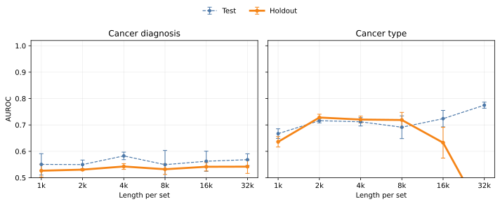
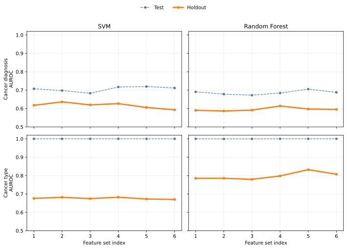

# BreCol: Cancer classification benchmark using gut microbiome data

## Abstract

Microbiome-based cancer prediction benchmarks routinely overestimate real-world performance because test samples are drawn from the same studies used for training,
allowing models to exploit study-specific technical artifacts rather than biological signal.
We present BreCol, a temporally structured multi-study compilation of 2,040 16S rRNA sequencing runs covering
breast cancer, colorectal cancer, and healthy cohorts across 26 studies spanning more than a decade.
By reserving the six most recent studies per cancer type as an external holdout,
we ensure that holdout evaluation reflects deployment on data from new laboratories, clinical protocols, and geographic regions.
We train four classifier pipelines: classical (tetramer counts aggregated to run-level frequencies or unsupervised-clustered for cluster abundance profiles (UC/CAP)),
deep learning (HyenaDNA modeling with pooled representation over sequences in the context), and hybrid (sequence-level HyenaDNA embeddings with UC/CAP profiles).
Against the BreCol benchmark, in-study test AUC for cancer type prediction falls by more than 0.4 points on holdout for the best classical classifier,
confirming that conventional evaluation dramatically inflates apparent model skill.
Among classical methods, UC/CAP achieves the strongest holdout performance (AUC 0.783 for cancer type with KNN, 0.664 for cancer diagnosis with SVM).
Compared to run-level tetramer freuqencies, HyenaDNA sequence modeling shows greater performance for both diagnosis and type classification,
but shows substantial seed-to-seed variance for cancer type [TODO: explain this better].
Finally, combining HyenaDNA's embeddings with cluster abundance profiles leverages complementary information in a hybrid architecture, [TODO: insert results].
Our benchmark and associated code are publicly available to support reproducible, credible evaluation of microbiome-based cancer classifiers.

## Introduction

The gut microbiome—the community of microorganisms inhabiting the human digestive tract—is increasingly linked to cancer risk and progression.
Large-scale epidemiological and mechanistic studies have associated compositional shifts in gut bacteria with colorectal cancer,
and growing evidence implicates gut dysbiosis in breast cancer as well.
Machine learning models trained on microbiome profiles have shown promise for distinguishing cancer patients from healthy controls within individual cohorts,
raising the prospect of non-invasive, microbiome-based cancer screening.

The dominant workflow for characterizing the gut microbiome is 16S rRNA amplicon sequencing.
A short, phylogenetically informative region of the bacterial ribosomal gene is amplified and sequenced,
and the resulting reads are matched to known reference taxa to produce species- or genus-level abundance tables.
Most machine learning studies operate on these pre-processed abundance tables, treating the raw sequence data as an intermediate artifact to discard.
This discards potentially informative signal: fine-grained genetic variation within taxa, sequences with no close reference in curated databases,
and compositional structure at the level of individual reads within a sample.
Methods that work directly on raw sequence data or on reference-free sequence features can in principle recover this signal.

A deeper problem, however, undermines nearly all published benchmarks in this area:
test sets are almost always constructed by random sampling from the same studies used for training.
This creates optimistically biased performance estimates that do not reflect real-world deployment,
in much the same way that spatial autocorrelation inflates apparent model skill in geographic prediction tasks.
In microbiome studies the bias is especially severe because technical factors—primer choice, sequencing platform, library preparation, regional microbiome variation—
introduce large study-level signals that a model can exploit without learning any biology [@whalen2022pitfalls].
For multi-class cancer-type prediction the problem is structural: breast and colorectal cancer samples almost always come from entirely separate studies,
so a classifier can achieve near-perfect in-study accuracy simply by identifying the study of origin rather than the disease.
Evaluating such a model on held-out samples from the same studies dramatically overestimates generalization.
A reliable benchmark must therefore evaluate models on studies they have never encountered during training [@whalen2022pitfalls].

We address this directly. We curate a multi-study compilation of 2,040 16S rRNA sequencing runs spanning 26 studies (13 breast cancer, 13 colorectal cancer),
covering healthy controls and two cancer types across studies from 2013 to 2026.
Studies are partitioned chronologically: the first seven studies per cancer type form the development set (training, validation, and test),
while the more recent six studies per cancer type are reserved as an external holdout.
This temporal and study-level separation means that holdout performance reflects the realistic scenario of applying a model trained on historical data
to future datasets from different laboratories, clinical protocols, and geographic regions.
To improve balance across studies, we randomly downsample the largest cohorts within each label stratum.
The resulting benchmark provides a demanding but credible measure of real-world generalizability.

Against this benchmark we evaluate a progression of approaches.
For classical machine learning we begin with run-level tetramer frequencies:
all 4-mer counts aggregated across the raw reads of each sequencing run, converted to relative frequencies.
This is a sequence-level representation that requires no taxonomic reference database.
We then introduce unsupervised clustering and cluster abundance profiles (UC/CAP), a reference-free method that preserves within-run compositional structure—
analogous in purpose to OTU-based approaches but operating entirely on sequence composition without taxonomic assignment.
For deep learning we fine-tune HyenaDNA [@nguyen2024hyenadna], a long-range genomic sequence model pre-trained on the human reference genome, directly on raw 16S reads.
Naïve fine-tuning proves unstable: the model achieves strong in-study test performance but fails to generalize across studies.
We show that this instability arises from shortcut learning of study-level confounders rather than from optimization noise alone,

Our main contributions are (1) a rigorously curated, temporally structured multi-study benchmark for microbiome-based cancer classification
that provides more reliable estimates of real-world performance than random within-study splits,
and (2) a multitask fine-tuning strategy for HyenaDNA that improves holdout generalization, most clearly for cancer diagnosis.

---

## Methods

### Data curation

Each sample corresponds to a sequencing run containing multiple 16S rRNA gene sequences.
We collected sequencing runs from studies covering breast cancer and colorectal cancer;
studies were only included if both cancer-positive and healthy control labels were available.
We stored SRA Run accessions (beginning with SRR, ERR, or DRR) and study metadata in the repository and downloaded each run's read archive from NCBI.

Our compilation spans 26 studies in total—13 for breast cancer and 13 for colorectal cancer (Table 1).
Arranged chronologically by publication year, the first seven studies per cancer type form the development partition
(train, validation, and test splits), and the more recent six studies per cancer type are reserved as the holdout partition.
Development and holdout sets are separated not only by study boundaries but also by time: all holdout studies are from 2023 onward.
This design makes the benchmark a realistic challenge: predictions must transfer to future datasets available only after the model was trained.

Some studies have substantially larger sample counts than others.
To improve study balance, we applied random sampling within several studies (stratified by cancer-versus-healthy label).
The sample sizes in Table 1 reflect counts after sampling at the indicated rate; these samples are flagged as `sample_used=TRUE` in the data CSV files.
Additionally, for two studies (BVW+21 and CAB+24) we excluded Runs with <2000 spots.

|study_name|study_year|doi|cancer_type|n_cancer|n_healthy|sample_rate|ncbi_bioproject|partition|
|---|---|---|---|---|---|---|---|---|
|AAM+13|2013|10.14309/00000434-201310001-00625|breast|29|32|1|PRJNA396901|development|
|GJH+15|2015|10.1093/jnci/djv147|breast|47|47|1|PRJNA345373|development|
|GHB+18|2018|10.1038/bjc.2017.435|breast|48|48|1|PRJNA383849|development|
|BVW+21|2021|10.1002/ijc.33473|breast|57|63|0.15|PRJNA658160|development|
|BSR+22|2022|10.1038/s41598-022-23793-7|breast|19|14|1|PRJEB54599|development|
|WZK+22|2022|10.3389/fmicb.2022.894283|breast|54|25|1|PRJNA804967|development|
|ZZZ+22|2022|10.1111/jam.15620|breast|14|14|1|PRJNA726050|development|
|SKC+23|2023|10.1038/s41598-023-27436-3|breast|22|21|1|PRJNA872152|holdout|
|LBA+25|2025|10.3390/ijms26146801|breast|76|16|1|PRJNA1127492|holdout|
|SYL+25|2025|10.1128/msystems.00879-25|breast|10|10|1|PRJNA1243283|holdout|
|MTK+26|2026|10.1016/j.gutmic.2026.100009|breast|32|32|1|PRJNA914483|holdout|
|SVK+26|2026|10.21203/rs.3.rs-8921895/v1|breast|22|30|1|PRJNA1356467|holdout|
|YTK+26|2026|10.1007/s44411-026-00523-3|breast|15|15|1|PRJNA1190698|holdout|
|ZTV+14|2014|10.15252/msb.20145645|colorectal|41|75|1|PRJEB6070|development|
|BRRS16|2016|10.1186/s13073-016-0290-3|colorectal|64|94|0.5|PRJNA290926|development|
|OKN+21|2021|10.1038/s41467-021-25965-x|colorectal|67|51|0.1|PRJDB11246|development|
|YDS+21|2021|10.1038/s41467-021-27112-y|colorectal|65|43|0.35|PRJNA763023|development|
|YWS+21|2021|10.1186/s13073-021-00844-8|colorectal|53|52|1|PRJEB36789|development|
|DLT+22|2022|10.3389/fphys.2022.854545|colorectal|27|33|1|PRJNA824020|development|
|PCL+22|2022|10.1038/s41598-022-14203-z|colorectal|36|25|1|PRJNA662014|development|
|BWY+23|2023|10.1186/s12866-023-02805-0|colorectal|46|43|1|PRJEB53415|holdout|
|BRR+24|2024|10.1186/s12864-024-10621-7|colorectal|51|51|1|PRJEB71787|holdout|
|CAB+24|2024|10.1002/1878-0261.13604|colorectal|90|30|1|PRJNA911189|holdout|
|SGH+24|2024|10.1016/j.micpath.2024.106726|colorectal|10|10|1|PRJNA1059759|holdout|
|ARF+25|2025|10.3389/fmicb.2025.1449642|colorectal|25|15|1|PRJEB76625|holdout|
|GYX+25|2025|10.1186/s12866-024-03721-7|colorectal|67|64|0.6|PRJNA1092526,PRJNA1092376|holdout|

### Preprocessing, splits, and sampling

We normalized sample labels to a restricted vocabulary: healthy, breast cancer, and colorectal cancer.
Breast cancer samples include invasive tumors; colorectal cancer samples include carcinoma.
Any benign samples (e.g. adenomas, benign colon polyps, and breast ductal carcinoma in situ (DCIS))
and non-fecal samples in the studies were excluded from our analysis.

Among development studies, we assigned each sequencing run to stratified training, validation, or test sets in a 70:15:15 ratio.
Runs from holdout studies were excluded from this assignment.
Split assignments were defined in advance from study lists and per-study sample tables, independent of any downstream feature computation.

We held the validation set fixed (no cross-validation).
This allows the same development splits to be used consistently across both the classical and HyenaDNA pipelines,
since GPU-intensive language model training makes repeated cross-validation expensive.
The same run-level split underlies both classification tasks: cancer versus healthy (cancer diagnosis) on all samples,
and breast versus colorectal (cancer type) restricted to cancer-positive samples.

For all classification pipelines we dropped the first 1000 sequences in each run as a QC measure.
We then randomly sampled 5000 sequences from the remaining sequences in each run (or used sequence sets packed to a maximum length for HyenaDNA training).
These sequences were used to create caches of sequence-level tetramer counts, embeddings, and tensors
that were sliced into for rapid experimentation with different sample sizes used for training.

### Run-level tetramer frequencies and classification pipeline

We calculated tetramer frequencies for each run by counting all 4-mers within each sequence,
summing counts over all sequences in the run, then converting to relative frequencies, yielding a 256-dimensional feature vector per run.

For the majority-class baseline, we predict the most frequent class in the training set for all samples.

**Hyperparameter grid search.**

The same classifier models and hyperparameter grids (Table 2) were used for run-level tetramer frequences and UC/CAP tetramer and embedding profiles (see below).

| Model | Hyperparameters |
|-|-|
| Baseline  |Majority-class (fixed setting) |
| KNN | PCA n_components (none, 0.95), n_neighbors (5, 15), weights (uniform, distance) |
| Random Forest | n_estimators (200, 500), max_depth (none, 10), min_samples_leaf (1, 2) |
| SVM | PCA n_components (none, 0.95), C (1.0, 10.0) |

For KNN and SVM we applied a centered log-ratio transform (CLR), standardized the CLR coordinates, then applied PCA.
We tuned the PCA components, number of neighbors, and distance weighting by grid search on the validation split only.

For random forest, we used the same CLR and standardization but omitted PCA.
We tuned the number of trees, maximum tree depth, and minimum samples per leaf on the validation split.

For SVM, we applied the same CLR, standardization, and PCA construction as for KNN,
then fit an RBF-kernel SVM, jointly tuning the PCA component count and penalty parameter *C* on the validation split.
The kernel width parameter *gamma* was left at scikit-learn's default ('scale').

After selecting hyperparameters using area under the receiver operating characteristic (ROC) curve (AUC) on the validation split, we fit each final pipeline on the training split.

### HyenaDNA sequence modeling and classification

We trained HyenaDNA on 16S RNA sequence data to test an end-to-end sequence model.
For each run, we read the FASTA file and split its sequences into a fixed number of non-overlapping sets.
Each set was packed to the model length limit and tokenized at the DNA character level.
Datasets were saved to disk so that training runs could reuse cached tensors without rebuilding the dataset each time.

We initialized HyenaDNA from pretrained weights, using a multitask configuration (two MLP classification heads attached the same backbone).
In a single forward pass, the cross-entropy loss for each task was computed separately then they were combined with a loss ratio used as a tuning parameter.
For example, 0.7 weights the cancer diagnosis task more heavily, while 0.5 weights both tasks evenly.

TODO: explain head architecture, how loss is used in backpropagation, learning rate configuration, other tuning parameters

Model size (e.g. 1k or 32k context), pooling mode, learning rate, batch size, number of epochs, and backbone freezing were configured through YAML files.
Because each run can produce multiple sequence sets, training loss was computed across all valid sets for each run.
At evaluation, we averaged set-level logits to obtain one prediction per run,
then computed AUC on the same test and holdout splits used for the tetramer and UC/CAP analyses.

### Cluster abundance profiles for tetramer counts

Run-level tetramer features summarize each sample with a single aggregate profile and do not capture how different sequence types are distributed within a run.
To preserve this within-run compositional structure, we use unsupervised clustering followed by cluster abundance profiles (UC/CAP),
a reference-free and alignment-free approach.

Because the sequence-level table is large, we first fit the unsupervised clustering model using only sequences from training-split runs,
drawing at most a fixed number of sequences per run.
For each selected sequence we computed a 256-dimensional tetramer composition vector,
then fit *k*-means to all selected sequences to obtain *K* centroids defining a sequence codebook.
Dimensionality reduction with PCA before *k*-means was trialed and found to degrade downstream classification results, so it was not used here.

To construct run-level features, we applied the same centroid assignments (without refitting)
to a larger per-run sequence budget for every run in the sequence-level table, including validation, test, and holdout runs.
We counted cluster memberships within each run and normalized by the number of assigned sequences to produce a *K*-dimensional cluster abundance profile (CAP).
These CAP vectors serve as the feature matrix for supervised classification on both binary tasks, with downstream classifiers selected separately per task.

### Cluster abundance profiles for HyenaDNA embeddings

Our fourth classification pipeline does not perform any training of HyenaDNA but uses the pre-trained 32k model to generate embeddings.
These 256-dimensional vectors were generated for sampled sequences in each run and used to produce UC/CAP profiles just like we did for tetramer counts.
Since embeddings can have negative values, they were standardized (or the CLR step was skipped) [TODO: check this].

A schematic of the four classification pipelines (Figure 1) [TODO: make figure] highlights their similarities and differences.
HyenaDNA sequence modeling uses a classification head that pools over all sequences in the context.
This aggregation step makes it similar to using run-level tetramer frequencies for classification.
In contrast, tetramer counts and HyenaDNA embeddings are raw sequence-level features that can both be used to build UC/CAP profiles that preserve compositional trends.
The differences is that tetramer count is an "engineered" feature, while embeddings are learned by the pretrained model (in the case of HyenaDNA, on the human genome).

Based on this picture, we propose carrying out performance comparisons at equal levels:
- At the run level: tetramer frequencies vs HyenaDNA sequence modeling
- At the sequence level: tetramer counts vs HyenaDNA pretrained embeddings (both fed into UC/CAP)

---

## Results

We define two binary classification tasks: **cancer diagnosis** (cancer vs. healthy, all samples)
and **cancer type** (breast vs. colorectal, cancer-positive samples only).
Performance is reported as AUC on the test split (unseen samples from the development studies used to train the model)
and the holdout split (entirely unseen studies).

For cancer type, all development studies for breast cancer are separate from all development studies for colorectal cancer.
A model can therefore exploit study-level signals, e.g. different sequencing protocols, primer sets, or regional microbiome composition,
as a near-perfect shortcut for in-study test performance.
Holdout performance, where the model encounters new studies it has not seen during training, removes this shortcut.
We accordingly expect cancer type to be the *easier* task for in-study test data but the *harder* task for holdout data.

For cancer diagnosis, each included study contains both cancer-positive and healthy samples,
so study identity alone does not predict the label. Models must learn biological differences between cancer and healthy microbiomes within studies,
and those differences are expected to transfer, at least partially, to new studies.

### Classification with run-level tetramer frequencies

Table 3 reports AUC on the test and holdout splits for four models: majority-class baseline, KNN, SVM, and random forest.

Numeric values for Table 3: [table3_tetramer.html](table3_tetramer.html).

All models exceed the majority-class baseline on the test split, with particularly large margins for cancer type prediction.
The holdout picture is sharply different.
For cancer diagnosis, SVM and KNN show modest gains above baseline (0.596 and 0.563, respectively),
while random forest falls below all other classifiers (0.541).
For cancer type, every model collapses toward or below baseline on holdout:
SVM reaches only 0.484 and KNN only 0.407, confirming that tetramer classifiers overfit to study-level signals when trained on single-study cancer-type data.

### Classification with HyenaDNA sequence modeling

We report a fine-tuning grid for the pretrained 32k HyenaDNA model.
Given available hardware (16 GB GPU memory), we are limited to smaller model sizes and sequence budgets than the full model supports.

**Hyperparameter ablations**

Table 4 summarizes results for the best recipe alongside targeted ablations, each reported as mean ± standard deviation across five random seeds.
Epoch is the mean epoch number for best mean AUC for both tasks on the validation split.

Numeric values for Table 4: [table4_hyenadna.html](table4_hyenadna.html).

Several trends are apparent in these ablations:
- Increasing learning rate, adding dropout, or decreasing the MLP hidden layer width have no discernable effect on test or baseline performance within error.
- Unfreezing the HyenaDNA backbone leads to higher performance on test split (most notably for cancer type classification) but lower gains on the holdout split.
- The improvements on holdout associated with unfrozen backbone are tempered by higher variability (larger standard deviation),
  highlighting stability issues with the model.

We also verified that using float16 AMP, gradient clipping (norm 1.0), or tuning by validation F1 instead of AUC did not move holdout AUC beyond error.

**Effects of modeled sequence length.**

For each task (cancer diagnosis and cancer type) we trained separate classification heads on the same backbone (multitask model).
We varied the length per set (up to 1k, 2k, 4k, 8k, 16k, and 32k positions) to study how much sequence context per run matters.
A single large cache (32k length for each sequence set) was built from randomly sampled FASTA sequences after skipping the first 1000 in each run.
Shorter training configurations were obtained from that cache by truncating to the target length.

Figure 1 shows AUC on the test and holdout splits as a function of length per set, within each task (columns).
Holdout performance is generally weaker than test performance.
The cancer diagnosis task shows mildly increasing performance with context length, but the cancer type curve is not monotone in context length.
Increasing the number of bases modeled per set does not reliably improve generalization for cancer type prediction.

### Classification with cluster abundance profiles for tetramer counts

We explored six combinations of the three UC/CAP hyperparameters: *n*UC (sequences per run used for unsupervised clustering),
*K* (number of clusters), and *n*CAP (sequences per run assigned to centroids and used to build cluster abundance profiles), listed in Table 5.

| Feature set | *n*UC | *K* | *n*CAP |
|-|-|-|-|
| 1 |  500 | 1000 |   500 |
| 2 | 1000 | 1000 |  1000 |
| 3 | 1000 | 2000 |  1000 |
| 4 | 1000 | 1000 |  5000 |
| 5 | 1000 | 2000 |  5000 |
| 6 | 1000 | 3000 |  5000 |

These UC/CAP parameters produced six different cluster abundance profiles (or feature sets) used for standard supervised classification
with the models and hyperparameter grids described above (Table 2). 
KNN consistently outperforms SVM across all six feature sets in holdout AUC for cancer diagnosis, but the pattern is reversed for cancer type (Figure 2).
For cancer type, both models show near-perfect in-study test performance across feature sets, but holdout values drop sharply.

Table 6 lists AUC values for each model on the UC/CAP feature set with the highest holdout AUC in each task.

Numeric values for Table 6: [table6_tetramer_uc_cap.html](table6_tetramer_uc_cap.html).

For cancer diagnosis, SVM achieves the best holdout performance, followed by random forest and KNN.
For cancer type, KNN leads on holdout, followed by random forest and SVM.

The gap between in-study test and holdout is again large for cancer type, but UC/CAP with KNN achieves substantially higher cancer type holdout AUC
than any tetramer-based classifier, demonstrating that richer within-run compositional features partially attenuate the study-level shortcut problem.

### Classification with cluster abundance profiles for HyenaDNA embeddings

We repeated the UC/CAP pipeline on sequence-level HyenaDNA embeddings (pretrained 32k model, no fine-tuning),
using the same six feature sets as for tetramer counts (Table 3).
Figure 3 shows holdout and test AUC across feature sets for SVM and random forest.
Holdout curves are comparatively flat: neither task shows the sharp swings seen with tetramer-based profiles in Figure 1,
suggesting that embedding CAPs are less sensitive to *K* and *n*CAP over this grid.

Table 7 lists test and holdout AUC for each model on the feature set with the highest holdout AUC in that task.

Numeric values for Table 7: [table7_embedding_uc_cap.html](table7_embedding_uc_cap.html).

Peak holdout AUC is similar for cluster abundance profiles built from embeddings versus tetramers.
For cancer diagnosis, SVM is the best model in both tables (holdout 0.636 with embeddings versus 0.626 with tetramers).
For cancer type, random forest leads with embeddings (0.832) while KNN leads with tetramers (0.855).
The winning feature sets differ by task and representation: for embeddings, cancer diagnosis peaks at feature set 2
(*K* = 1000, *n*CAP = 1000) whereas cancer type peaks at feature set 5 (*K* = 2000, *n*CAP = 5000).
This profile is consistent with SVM benefiting from lower-dimensional,
smoother inputs while random forest can exploit richer cluster structure when separating studies in embedding space.

---

## Discussion

Results are consistently lower on the holdout splits than on the in-study test splits,
confirming that test performance computed within the same studies used for training gives overoptimistic estimates of real-world model skill.
This pattern holds across every method we evaluate.

The asymmetry between tasks is informative.
Cancer type classification achieves in-study test AUC above 0.95 for virtually every model,
because breast and colorectal samples come from completely separate studies.
The model can predict cancer type by identifying the study of origin, exploiting differences in sequencing protocol, primer region,
or regional microbiome composition rather than biology.
On holdout data, where these shortcuts no longer generalize, cancer type AUC collapses toward or below chance for most models.
In contrast, cancer diagnosis test AUC is more moderate (around 0.7 for the best classical models),
because models must distinguish cancer from healthy samples within studies that contain both—a genuinely harder discrimination.
The corresponding holdout AUC drops are smaller, suggesting that at least some of the learned signal reflects
biological differences between cancer and healthy microbiomes that transfer across cohorts.

Comparing holdout performance across Tables 3 and 6, UC/CAP offers a consistent advantage over run-level tetramer features,
most clearly for cancer type prediction with KNN.
The SVM + UC/CAP combination (holdout AUC 0.783 for cancer type, 0.664 for cancer diagnosis) substantially outperforms SVM + tetramers on holdout,
despite comparable or identical in-study test performance [TODO: discuss KNN for UC/CAP].
UC/CAP features capture within-run compositional diversity and are analogous in purpose to OTU-based richness features but without a taxonomic reference.
Our finding suggest that the compositional information partially breaks the study-level shortcut that ruins tetramer-based cancer type classifiers.

It's interesting that SVM consistently performs so *well* for cancer diagnosis but so *poorly* for cancer type (relative to KNN and random forest).
Cancer diagnosis pools a single binary label across many studies with mixed design.
The UC/CAP vector is a compressed compositional summary where a relatively low-dimensional signal (after CLR, scaling, and PCA)
can separate cancer-like from non-cancer profiles without many interacting cluster dimensions.
This is the regime an RBF SVM favors, with a smooth boundary when a few directions carry most of the margin.
Conversely, cancer type in our benchmark is largely confounded with study bucket (breast-only versus colorectal-only studies).
The shortcut is less one smooth direction than a high-dimensional fingerprint of protocol, depth, primer region, batch, and geography spread across cluster abundances.
Random forest can stitch together many weak, axis-aligned rules and KNN can exploit similar structure locally in PCA space,
whereas SVM still defines essentially a single boundary.
When discrimination is combinatorial across clusters, that bias can fit the in-study test split with a hyperplane on a few principal components aligned with study,
then fail on holdout studies where those directions do not transfer.

[TODO]: Reiterate that we're using HyenaDNA in two modes: fitting a classification head on the backbone, and using embeddings for cluster profiling.
In both cases we use the pretrained model and don't modify backbone weights (except for some ablations described above).
Even at 16k tokens per set and 5 sets per run, HyenaDNA sees only around 400 sequences from each sample (assuming 200 nt 16S fragments),
a small fraction of what the tetramer and UC/CAP methods use.
Also, using a classification head across sequences is tanamount to a run-level representation, losing compositional information.
Passing HyenaDNA embeddings to the UC/CAP pipeline preserves more of the compositional information but in our study relies only on pretrained backbone without fine-tuning.

Several directions may improve performance beyond current baselines.
On the feature side, UC/CAP parameters (*K*, *n*CAP) could be tuned jointly with the classifier rather than independently,
and soft cluster assignments (Gaussian mixture or fuzzy *k*-means) might better represent the continuous composition of microbial communities.
For HyenaDNA, additional pre-training on 16S rRNA sequences specifically (rather than the human genome)
would better align the model's learned representations with the target domain.
We could also consider using other embedding models, e.g. SetBERT which has specifically be trained on 16S rRNA sequences [@setbert2024]. 

More broadly, our results underscore a general lesson for machine learning applied to genomic and microbiome data:
evaluation quality matters as much as model sophistication.
Metrics computed on within-study test splits can be misleading by a wide margin.
In our benchmark, cancer type AUC falls by more than 0.4 points from test to holdout for the strongest classical classifiers.
Robust evaluation against temporally and geographically diverse holdout cohorts should be a standard requirement in this field [@whalen2022pitfalls].

## Acknowledgments

This study uses data made available by many previous studies.
All contributors to those studies are acknowledged for making this study possible.

## References

::: {#refs}
:::
